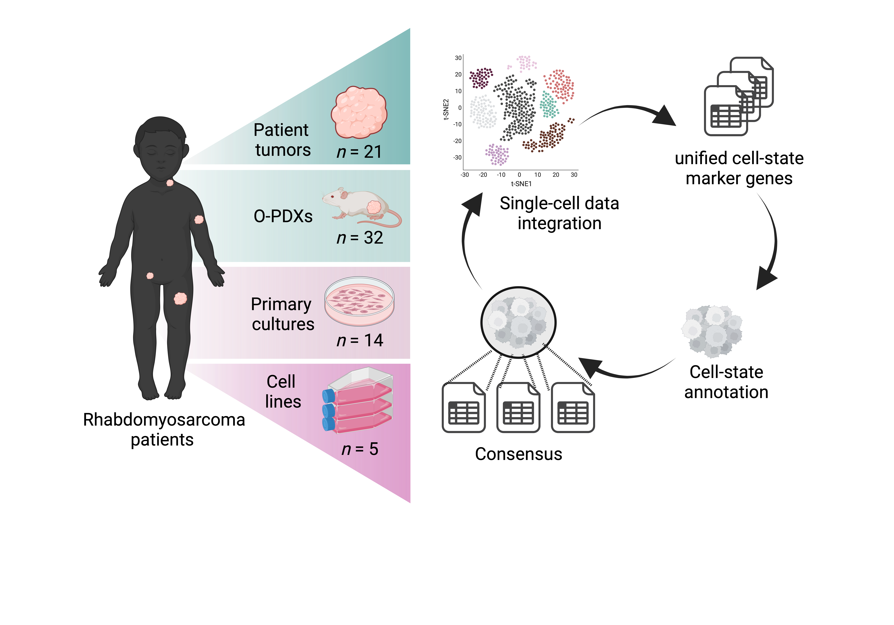

# RMS-metadata

  

Steps used for this project

---

**METADATA ANALYSIS OF ALL RMS SAMPLES (Fig. 1, Fig.2, Fig. 3)** 

**0. Preprocessing**
- use script `merging_datasets.R` inside the preprocessing folder to import the datasets, subset to:
  - import .rds files
  - subset cells to random 1500 cells to speed up computational analysis
  - for Patel et al. the files were mapped to both human and mouse genome; therefore human cells were filtered using 'Tumor' annotation, and only human genes ('hg19') were selected. Gene names were renamed to be consistent with the other publications
  - add metadata

**1. Merging all RMS datasets from different publications**
- use script `merging_datasets.R` inside the preprocessing folder to import the datasets, subset to combine datasets combined using 'merge' function. No regression applied

**2. Analyze objects without regressing out inter-sample differences**
- use `1_Integration_no_regression.R` script, to create UMAP plots of samples before regression 

**3. Integrate objects using RPCA to remove inter-sample differences**
- use `2_Integration_all.R` script to remove inter-sample differences (stored in 'name' metacolumn). The script uses RPCA correction (Fig. 1)

**4. Score cells using metaprograms identified in the original publications**
- use `3_Scoring.R` script to score RPCA-integrated object for cell cycle and metaprogram scores

**5. Downstream analysis of RPCA-integrated object**
- - use `4_Analysis_all.R` to:
   - define high- vs low-cycling cells based on S.scores and G2M.scores
   - run PCA and UMAP
   - identify Louvain clusters, their markers, and assigns them names

**6. Visualization plots of RPCA-integrated object**
- Use `5_Plots_all.R` to visualize UMAPS, heatmap, etc.

  ---
 
 **METADATA ANALYSIS OF MOLECULARLY-DEFINED RMS SUBTYPE (FN-RMS, FP-RMS PAX3::FOXO1, FP-RMS PAX7::FOXO1) (Fig. 4)** 
 
**0. Preprocessing**
- use script `merging_datasets.R` inside the preprocessing folder to import the datasets, subset to:
  - import .rds files
  - subset cells to random 1500 cells to speed up computational analysis
  - for Patel et al. the files were mapped to both human and mouse genome; therefore human cells were filtered using 'Tumor' annotation, and only human genes ('hg19') were selected. Gene names were renamed to be consistent with the other publications
  - add metadata

**1. Merging all RMS datasets from different publications**
- use script `merging_datasets.R` inside the preprocessing folder to import the datasets, subset to combine datasets combined using 'merge' function. No regression applied
 
**2. Integrate objects using RPCA to remove inter-sample differences and score them**
- use `2_Integration_FP-RMS_P3F1.R`, `2_Integration_FP-RMS_P7F1.R`, `2_Integration_FN-RMS.R` scripts to:
  - subset combined dataset based on molecular subtype
  - integrate objects using RPCA correction to remove sample differences
  - the scripts automatically scores the objects for module scores

**3. Downstream analysis of RPCA-integrated object**
- - use  `4_Analysis_FP-RMS_P3F1.R`, `4_Analysis_FP-RMS_P7F1.R`, `4_Analysis_FN-RMS.R`  to:
   - define high- vs low-cycling cells based on S.scores and G2M.scores
   - run PCA and UMAP
   - identify Louvain clusters, their markers, and assigns them names

**4. Visualization plots of RPCA-integrated object**
- Use `5_Plots_FP-RMS_P3F1.R`, `5_Plots_FP-RMS_P7F1.R`, `5_Plots_FN-RMS.R`  to visualize UMAPS, heatmap, etc.
  
**5. Visualize overlap between marker genes across different molecular subgroups (Fig. 3B)**
- Use `correlation_signatures.R` script to identify overlapping genes across cell states from different RMS subtypes and to plot Fig. S3B
 
 
     ---
 
 **ANALYSIS OF RMS DUPLICATE SAMPLES SEQUENCED ACROSS DIFFERENT LABS** 

- use `6_Analysis_matched_samples` script, which:
  - imports integrated RMS object (from Fig. 1) and subsets it to pairs of interest
  - visualizes distribution of samples on UMAP and bar plot of cell proportions
 
   ---
 
 **ANNOTATION OF RMS TUMOR DATASET BASED ON DEVELOPMENTAL SCRNASEQ DATA (Fig. 4)** 
Scripts are stored under `developmental_reference` folder

Raw data from Xi et al. Dev. Cell. 2020 have been downloaded from: https://cells.ucsc.edu/?ds=skeletal-muscle

**1. Cleanup of Xi et al. Dev. Cell 2020 dataset**
- use `1_read_Xi_dev_muscle.R`, which:
  - imports dataframes
  - performs Seurat pipeline for downstream analyses 

**2. Transfer annotations from developmental dataset onto tumors**
- use `2_Labeltransfer_dev_muscle.R` script, which uses SingleR to transfer either developmental time point or annotation onto RMS tumors

**3. Plot distribution across developmental time points**
- use `3_Barplot_distribution.R` script to import metaata saved from step above, and to plot Fig. 4E, 4F

   ---
 
 **ANALYSIS OF RMS PATIENT SAMPLE PAIRS OBTAINED DURING DIAGNOSTIC BIOPSY AND DELAYED RESECTION (Fig. 5)** 
Scripts are stored under `FFPE` folder

**Score dataset with signature modules and plot scores**
- use `1_Scoring_FFPE_Patient.R` script

 ---
 
 **ANALYSIS OF PDX BIOPSY SAMPLES FROM SJRHB013759_X1 OBTAINED DURING THERAPY (Fig. 5)** 
Scripts are stored under `PDX_treatment` folder

**2.Score dataset with signature modules and plot scores**
- use `Scoring_SJRHB013759_X14.R` script

